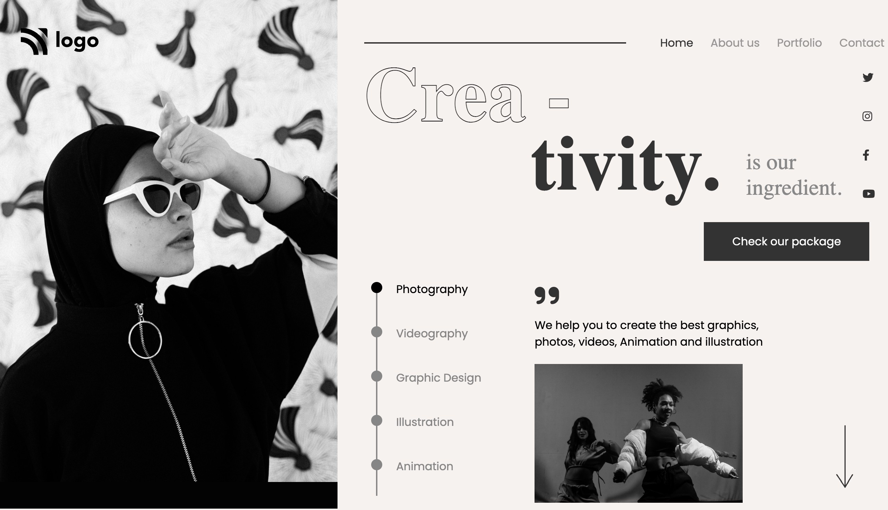

# Dance Home Page

- This is a Dance Home Page, made using html and css 

## Built with

- Semantic HTML5 markup
- CSS custom properties
- Flexbox
- media query

## What I learned
- I learned how to arrange components with flexbox, usage of media query, usage of flex direction to row and column where ever needed and solved many bugs while building webpage.
- Made use of flexbox in most of the places instead of position to make it responsive in most screens

## Time taken
- It took me around 5 hours to built this website from scratch.

## Links
- [live demo](#)
- [source](#)

## Contact me
- GitHub - [@RAM844](https://github.com/RAM844)
- Twitter - [@ShriramBalaji7](https://www.twitter.com/ShriramBalaji7)

## Screenshot

1. 
2. 
